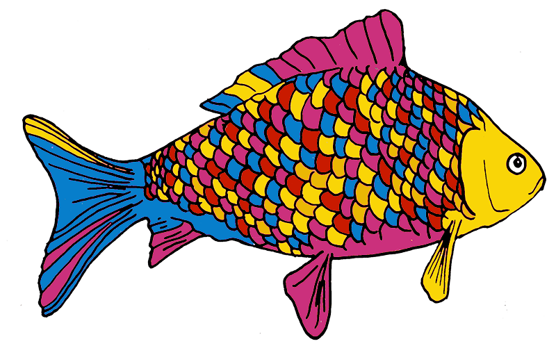
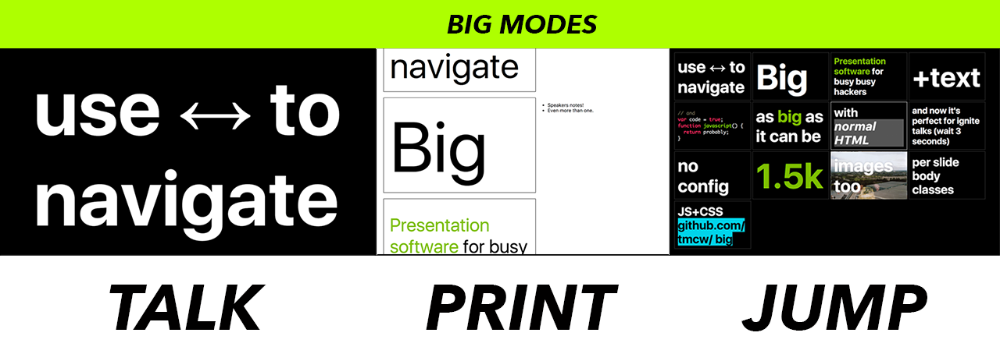

# Big

<p align="center">
  
</p>

<p align="center">
  <strong>Big.</strong> The antidote to your presentation procrastination.
</p>

A presentation system that works great for creative, hurried people making focused presentations. Stop tweaking fonts and filling slides with text. Big is a configuration-free system that naturally encourages good style.

- [Features](#features)
- [Quickstart installation: Glitch](#quickstart-installation--glitch)
- [Alternative method: Local installation](#alternative-method-local-installation)
- [Writing a presentation](#writing-a-presentation)
- [Giving presentations](#giving-presentations)
- [Using Big](#using-big)
  - [Layouts & Images](#layouts---images)
  - [Customizing the aspect ratio](#customizing-the-aspect-ratio)
  - [Avoiding line breaks](#avoiding-line-breaks)
  - [Auto advancing slides](#auto-advancing-slides)
  - [Showing code](#showing-code)
  - [Backgrounds & body classes](#backgrounds---body-classes)
  - [Themes](#themes)

## Features

- The entire system is about 16kb
- Slide layouts based on CSS Grid
- Speakers notes appear in your developer console, which you can put on your other screen
- Themes are just CSS, and easy to make

## Quickstart installation: Glitch

The absolute fastest way to get started is with Glitch. Just click the link below, and you’ll get the freshest version of Big, in a Glitch app that you can edit and publish.

<!-- Remix Button --><a href="https://glitch.com/edit/#!/remix/tmcw-big">  </a>

With Glitch, your presentation will be online and open source by default. You can download it and continue to work on it offline, or if you want to start offline by default and have the files locally, follow the alternative method below 👇

## Alternative method: Local installation

If you use NPM, the fastest way to get a copy of Big is this way:

```bash
$ npx degit tmcw/big
```

Preview the presentation locally by double-clicking on `index.html`. Create a repository with it to share the presentation with Github Pages, or post the files to any other hosting service. You’ll want to eventually use a real server instead of opening the file - to do that, install `serve` and run it:

```bash
$ npm install -g serve
$ serve
```

## Writing a presentation

Big presentations are webpages: slides are `div` elements, and any text styling or additional elements are addable by using HTML. The text in each div is sized to fit the screen. A slide can be as simple as:

```html
<div>Big</div>
```

If you want speakers notes - notes that you can see on your laptop screen but aren't shown on the main projector - you can use a `<notes>` element:

```html
<div>
  Citrus
  <notes>Aren't oranges, lemons, and limes great?</notes>
</div>
```

Open your [developer console](http://debugbrowser.com/), and you'll see your speaker notes in it when you visit that slide! In most browsers, the console is detachable, so you can move it to a different screen or window when you're giving the presentation.

That's all you need to start writing presentations!

## Giving presentations

You can advance slides the usual way, by clicking them. You can also use the left & right arrow keys, and the up and down arrow keys. On touch devices, you can navigate forward by tapping and also navigate forward and backwards by swiping.



Big also has three modes if you want to quickly jump to a slide, or print a presentation. You can switch between modes by hitting the `t`, `p`, and `j` keys.

* **t**alk is the default mode. Slides are shown one at a time.
* **p**rint: is useful for print output or as an overview: it'll include
  two slides per printed page, and shows speakers notes along with slides
* **j**ump: Shows many slides per page, useful for quickly finding a slide and 'jumping' to it. When you're in jump mode, you can use the arrow keys to quickly select a slide and hit Enter to jump to that slide, or click the
  slide you want.

## Using Big

Big is designed to be simple, so if you just want to give a [Takahashi](https://en.wikipedia.org/wiki/Takahashi_method) style presentation with just text, you don't need to read any further! But it can also go far beyond the basics.

### Layouts & Images

Let's say you want to add some pictures to a presentation. If you just want the slide to _be_ an image, you can just make it the only thing on the slide:

```html
<div>
  
</div>
```

And Big will appropriate size and place the image in the center.

If you want an image and text, you'll need a little more infrastructure: this is where _layouts_ come in. See, the idea of Big is that it sizes text as big as it can be. This has the effect that if you include something else on a slide, like an image, then it'll be squeezed out by ever-expanding text. So if you want to include an image and some text, you'll need to set some ground rules for how much space each is permitted to take up. Luckily, this also lets us do flexible layouts of image and text - you can choose how they're arranged, and they'll gleefully comply.

```html
<div
  class='layout'
  style='grid-template-columns: 1fr;grid-template-rows:75% 25%;'>
  
  <div>A longer description!</div>
</div>
```

So you'll see that we have two new attributes for this laid-out slide:

`class='layout'` triggers a few styles from `big.css` that give the slide [grid layout](https://developer.mozilla.org/en-US/docs/Web/CSS/grid), make its subsections [flexbox](https://developer.mozilla.org/en-US/docs/Learn/CSS/CSS_layout/Flexbox), and tweaks how images work. For all slides that use layout, they'll use the layout class.

The second bit - the `style` attribute, is where the customization comes in. The MDN documentation for [grid-template-rows](https://developer.mozilla.org/en-US/docs/Web/CSS/grid-template-rows) and [grid-template-columns](https://developer.mozilla.org/en-US/docs/Web/CSS/grid-template-columns) is where to start if you want to learn this inside & out, but for those that tend to learn from examples, here are some!

**50% / 50% split columns: picture on the left, text on the right**

```html
<div class=layout style='grid-template-columns: 50% 50%;'>
  
  <div>A longer description!</div>
</div>
```

Grids read from left to right, top to bottom, unless you customize that with extra CSS. You'll need to specify at least grid-template-columns or grid-template-rows to divide up a cell: if you specify columns, it'll be divided horizontally, if rows, vertically.

**75% image on the top, 25% text on the bottom**

```html
<div class='layout' style='grid-template-rows:75% 25%;'>
  
  <div>A longer description!</div>
</div>
```

This slide will be laid out vertically, with the image taking up 75% of the vertical space, text 25%.

***Three rows of a 25% image and 75% text***

```html
<div
  class=layout
  style='grid-template-columns: 25% 75%;grid-template-rows:repeat(3, 30%);'>
  
  <div>Yes</div>
  
  <div>No</div>
  
  <div>Just right, a lot of text goes here.</div>
</div>
```

### Customizing the aspect ratio

To keep presentations uniform across devices, Big keeps the aspect ratio of presentations constant by default: by default, presentations are 4:3 aspect ratio.

You can customize the aspect ratio by setting a `BIG_ASPECT_RATIO` variable _before_ Big is included on a page:

```html
<script>BIG_ASPECT_RATIO=2;</script>
<script src='big.js'></script>
```

You can also turn this feature off, by setting `BIG_ASPECT_RATIO` to `false`, which will let presentations occupy the aspect ratio of the device they're displayed on:

```html
<script>BIG_ASPECT_RATIO=false;</script>
<script src='big.js'></script>
```

### Avoiding line breaks

By default, Big will wrap lines of text. Sometimes you don't want this to happen, if you have some text that would look odd wrapped. In this case, you can use the `nowrap` class to keep some text from wrapping.

```html
<div>
  beyond the <code>for</code> loop
  <br />
  <small class=nowrap>@tmcw / Tom MacWright</small>
</div>
```

### Auto advancing slides

Sometimes you'll give presentations like [PechaKucha](https://en.wikipedia.org/wiki/PechaKucha) and [Ignite](https://en.wikipedia.org/wiki/Ignite_(event)) involve auto-advancing slides. You can achieve this by adding a `data-time-to-next` attributes to slides: this will cause  them to auto-advance after a specific number of seconds:

```html
<div data-time-to-next=20>
  My sales pitch in 20 seconds
</div>
```

### Showing code

There are many ways to do code highlighting in presentations. My personal
philosophy is that you should never show more than 8 lines of code
on a slide, and instead of using traditional semantic highlighting, you should
manually add emphasis to focus points in the code.

```html
<div>
    problem one: make some animals rock
    <pre>var animals = <em>['cats', 'dogs']</em>;</pre>
</div>
```

```css
pre {
  margin:0;
  padding:0.2em;
  background:#fff;
  color:#000;
  font-weight:normal;
}

pre em {
  color:#000;
  background:yellow;
}
```

But if you want traditional code highlighting, you can include [highlight.js](https://highlightjs.org/) to do just that. You'll want to include [the library](https://highlightjs.org/download/), and use `hljs.initHighlightingOnLoad();` like [in their usage instructions](https://highlightjs.org/usage/).

### Backgrounds & body classes

You might want to customize the class & style of the body element for a single slide. For example, maybe you want to change the background of the full page. You can do this with two attributes: `data-body-style` and `data-body-class`:

```html
<div data-body-style="background-image:url(airplane.gif)">
  <div>Slide will have an airplane background</div>
</div>
```

### Themes

Big presentations are hackable, so you can design yours from scratch, or by customizing one of the default themes, but there are also a few default themes so that you can get going with a solid aesthetic right off the bat.

At the very least, themes are CSS files. You can pick a theme by picking one in the `themes` directory. Bundled with Big are these themes:

- **dark**: near-black background and near-white text, this one is my go-to for most presentations that rely on underpowered projectors.
- **light**: like dark, but flipped.
- **white**: instead of tastefully off-white and off-black, this theme uses stark, literal black & white colors.
