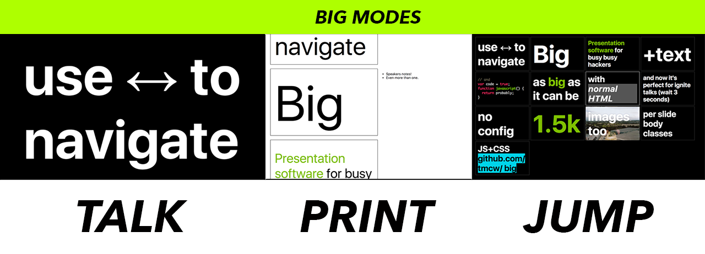

## Install

The best way to get started with big is the `big-presentation` module,
which helps create and serve presentations. Install it globally with `npm` or
`yarn`:

* `npm install -g big-presentation`
* `yarn global add big-presentation`

## Using `big-presentation`

`big-presentation` is the tool you use to create, manage and give big presentations.

When you install it with npm or yarn, you get these four utilities:

* `big-presentation-init`
  * Initializes presentations. Run it just like that to dump the necessary
  files in the current directory, or specify a directory name to create
  a new directory and put the files in that.
* `big-presentation-serve`
  * Serves up your presentation.
* `big-presentation-offline`
  * Creates an `index.offline.html` file with everything that can be included,
    included inline in the HTML, so you don't have to trust wifi
* `big-presentation-compose`
  * Writes from a file you've composed in [Markdown](https://help.ghost.org/hc/en-us/articles/224410728-Markdown-Guide) 
  into html suitable for a big presentation. (Writes from `index.md` to `index.html`)

## Writing a presentation

* A `div` is a slide.
  * Divs can be nested without nested divs being treated as slides
  * There are two built-in **themes**: light and dark. You set a theme by setting
    the `class` of the `body` element. By default, `big-presentation-init` chooses
    `light`. Change it to `dark` to make presentations dark and cool.
  * `div` elements can have special attributes that affect the presentation:
    * `data-time-to-next="5"` causes the slide to auto-advance after 5 seconds, or the number you specify
    * `data-bodyclass="something"` adds a custom class to the body tag when the slide is displayed
    * `data-background-image="url"` sets a background image for the slide
  * Slides can contain speakers notes, which you put in `<notes>` elements, like
    `<notes>Write your speakers notes here</notes>`.
    Speakers notes will appear in your web developer console when you're on
    the slide. They'll also appear in print mode.
  * Slides are fixed at the aspect ratio **1.6**: they'll fit a 1.6x box
    inside of the current display size. You can customize this ratio by hacking
    Big, if you want to.

## Talk, Print, and Jump Modes



Big has three modes, which you can swap between by hitting `t`, `p`, and `j`.

* **t**alk: this is what you use to give a presentation.
* **p**rint: useful for print output, or as an overview: will typically provide
  two slides per printed page, and shows speakers notes along with slides
* **j**ump: Shows many slides per page, useful for quickly finding a slide
  and 'jumping' to it.

# `big-presentation-compose`

## Writing a presentation

Presentations written for `compose` are written in Markdown, not HTML, and
slides are separated by `---`, which is usually the Markdown code for a
`<hr />` horizontal rule element. For instance:

```markdown
It's _big_, but a little more eazy

---

Put dashes between slides to separate them.

---

Supports lists

* Like
* This
* One
```

This text would be in the file `index.md`, and when you run `big-presentation-compose`,
each section separated by `---` gets wrapped in a `<div>` element, the list
becomes HTML, and the rest of [Markdown syntax](https://daringfireball.net/projects/markdown/syntax)
becomes HTML.

## `big-presentation-compose` troubleshooting

big-presentation-compose copies `big.js`, `big.css`, and other files that make
your presentation work into the specified directory, but it makes sure never
to overwrite them if they already exist.

So, if you've customized big.js or big.css but want to get a fresh copy by running
big-presentation-compose, you'll need to delete it first, and then big-presentation-compose
will add a new copy in there: it'll never overwrite your existing dependency files.
That said, it _will_ overwrite the generated `index.html` file, because that makes
it way easier to work on a presentation.
